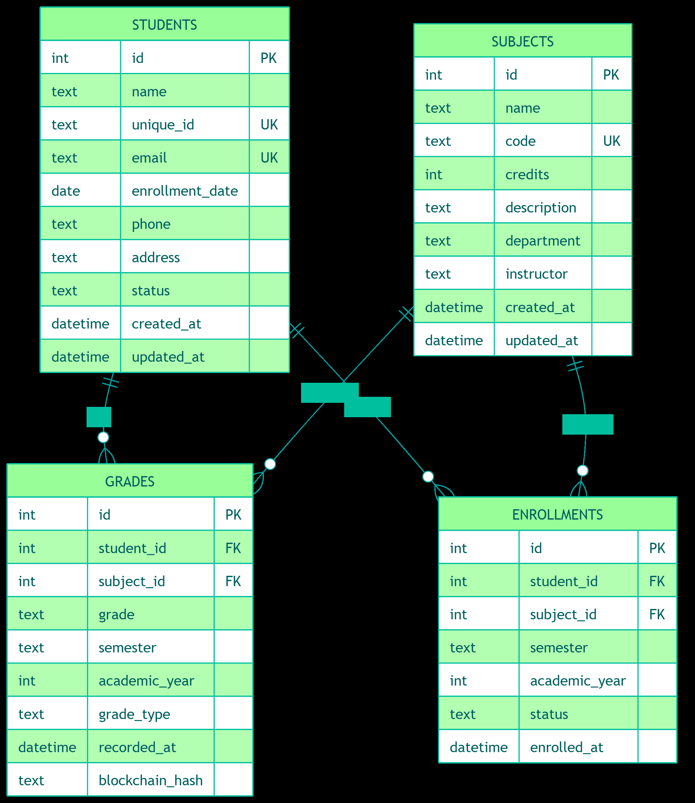

# 📚EduLedger - University Management System

EduLedger is a next-generation university management system that seamlessly integrates traditional database management with cutting-edge blockchain technology. Built for educational institutions seeking secure, transparent, and efficient academic record management.

## 🌟 Key Features
### 📱 Academic Management

- **Student Information System:** Comprehensive student profile management
- **Subject Catalog:** Dynamic course and subject organization
- **Grade Analytics:** Real-time academic performance tracking
- **Semester Management:** Multi-semester academic workflow support

### 🔐 Blockchain Integration

- **Immutable Grade Records:** Tamper-proof academic transcripts
- **Transparent Verification:** Instant grade verification for stakeholders
- **Decentralized Trust:** Elimination of academic fraud
- **Audit Trail:** Complete history of all grade modifications

### 👨‍💼 Administrative Tools

- **Role-based Access Control:** Secure admin authentication
- **Comprehensive Dashboard:** Real-time system analytics
- **Bulk Operations:** Efficient mass data management
- **Report Generation:** Automated academic reports

## 🏗️ System Architecture


## ⬇️ Installation

1. Clone the repository:
```bash
git clone https://github.com/yourusername/eduledger.git
cd eduledger
```

2. Install dependencies:
```bash
npm install
```

3. Start the server:
```bash
npm start
```

For development:
```bash
npm run dev
```

- Web Interface: http://localhost:3000

## 🔃 Docker Deployment

To run the application using Docker:

```bash
docker build -t eduledger .
docker run -p 3000:3000 eduledger
```

## 🔑 API Endpoints

### 1. Student Management
| Method |     Endpoint      | Description |
|:------:|:-----------------:|:------------|
|  POST  |   /api/students   | Add a new student|
|  GET   |   /api/students   | Get all students|
|  GET   | /api/students/:id | Get student by ID          |
|  PUT   | /api/students/:id | Update student information |
| DELETE | /api/students/:id | Delete a student  |

### 2. Grade Management
| Method |         Endpoint       | Description |
|:------:|:----------------------:|:------------|
| POST   |      /api/grades       | Add a new grade|
|  GET   | /api/grades/:studentId | Get grades for a student|
|  GET   | /api/grades/blockchain | View blockchain grade records|

### 3. Subject Management
| Method |     Endpoint      | Description |
|:------:|:-----------------:|:------------|
| POST   |  /api/subjects    | Add a new subject|
|  GET   |   /api/subjects   | Get all subjects|
|  PUT   | /api/subjects/:id | Update subject information|

## 🗄️ Database Schema



## 🔐 Security

- Admin authentication required for sensitive operations
- Blockchain integration for immutable grade records
- CORS protection enabled
- Input validation and sanitization

## 📜 License
This project is licensed under the MIT License - see the [LICENSE](LICENSE) file for details.
